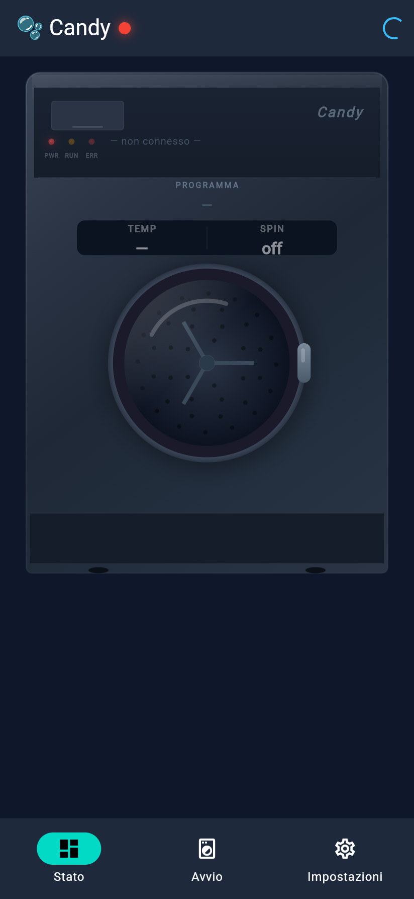

# 🫧 Simply Candy

**Controllo locale reverse-engineered e App Multi-piattaforma per Lavatrici Candy BWM 149PH7 (e serie Bianca / simply-Fi)**

[](https://www.python.org/)
[](https://flutter.dev/)
[](https://fastapi.tiangolo.com/)
[](LICENSE)

**Simply Candy** consente il controllo diretto, la consultazione e il monitoraggio in rete locale (LAN) delle lavatrici Candy della serie Bianca (modello **BWM 149PH7** e compatibili), bypassando l'infrastruttura Cloud durante il normale funzionamento. 

Il progetto include sia **strumenti CLI / API in Python** sia una **App nativa in Flutter** (Android, iOS, Windows, macOS, Linux, Web).

---

## 📸 Screenshots & Demo

| Dashboard Flutter App | Interfaccia Web FastAPI |
| :---: | :---: |
|  | *Web UI locale servita su `http://localhost:8000`* |

---

## 🌟 Caratteristiche Principali

- 🔒 **Comunicazione Locale Cifrata (XOR)**: Parlano direttamente con la lavatrice via HTTP (`http-read.json`, `http-write.json`) in rete locale.
- 🔑 **Scambio Chiave Automatico**: Derivazione ed estrazione della chiave di cifratura XOR a 16 byte con fallback multi-livello e caching locale (`candy_key.cache`).
- ☁️ **Importazione Catalogo da Cloud (CIAM OAuth2)**: Flusso di autenticazione sicuro OAuth2 + PKCE verso Salesforce Candy Cloud per scaricare le definizioni ufficiali dei programmi e le maschere delle opzioni (`OptMsk1`, `OptMsk2`).
- 🛡️ **Fail-Safe & Sicurezza**:
  - Modalità `--dry-run` attiva di default per prevenire l'avvio accidentale del ciclo durante i test.
  - Validazione dei parametri (temperatura, centrifuga, grado di sporco, opzioni) rispetto ai range ammessi da ciascun programma.
  - Scrittura atomica del catalogo `programs.json` con backup di ripristino.
- 📱 **App Flutter Multi-piattaforma**:
  - Scansione e scoperta automatica dell'IP della lavatrice sulla sottorete LAN (`/24`).
  - Grafica CustomPainter con oblò animato, riflessi, livello acqua e cestello rotante.
  - Display LCD in stile retro per il tempo residuo.
  - Gestione dei lavaggi Preferiti con nomi personalizzati.
- 🐍 **Suite Python & API REST**:
  - CLI per lettura stato, invio comandi e stop ciclo (`candy_sendprogram.py`).
  - Server web FastAPI integrato (`candy_web.py`) con dashboard responsive.

---

## 📐 Architettura del Sistema

```
                      [ Candy Salesforce Cloud ]
                                  ▲
                                  │ (OAuth2 CIAM / Simply-Fi REST API)
                                  ▼
 ┌─────────────────────────────────────────────────────────────────┐
 │                        Python Ecosystem                         │
 │                                                                 │
 │   [ candy_ciam.py ] ──► [ candy_cloud.py ] ──► [ catalog ]      │
 │                                                      │          │
 │   [ candy_programs.py ] ◄────────────────────────────┘          │
 │            │                                                    │
 │            ▼                                                    │
 │   [ candy_sendprogram.py ] (XOR 16-byte Cipher + Payload Gen)   │
 │         ▲             ▲                                         │
 │         │             │                                         │
 │    (CLI Engine)  [ candy_web.py ] (FastAPI Web & REST API)      │
 └─────────┼─────────────┼─────────────────────────────────────────┘
           │             │
           ▼             ▼
   [ Direct Local HTTP Protocol ] ◄─── [ Flutter Cross-Platform App ]
           │                                 (Dart Port of Core,
           │                                 Subnet Scan, Custom UI)
           ▼
[ Candy BWM 149PH7 Washing Machine (WiFi LAN @ 192.168.1.xxx) ]
```

---

## 🚀 Guida Rapida — Python (CLI & Web UI)

### 1. Prerequisiti e Installazione

```bash
# Clona il repository
git clone https://github.com/emilius3m/simply-candy.git
cd simply-candy

# Crea un ambiente virtuale
python -m venv .venv

# Attiva l'ambiente virtuale
# Su Windows (PowerShell):
.\.venv\Scripts\Activate.ps1
# Su Linux/macOS:
source .venv/bin/activate

# Installa le dipendenze
pip install -r requirements.txt
```

### 2. Importazione del Catalogo Programmi dal Cloud

L'importazione serve solo la prima volta per creare il file `programs.json` personalizzato per il proprio modello:

```bash
python candy_import_programs.py
```

> **Flusso di autenticazione sicuro**: Lo script aprirà il browser sulla pagina di login ufficiale Candy (`id.candy-home.com`). Non vengono inserite credenziali nel terminale. Al termine del login, copia l'URL di reindirizzamento `candy://...` e incollalo nel terminale.

### 3. Utilizzo della CLI

```bash
# Elenca tutti i programmi disponibili nel catalogo
python candy_sendprogram.py list

# Leggi lo stato attuale della lavatrice in rete
python candy_sendprogram.py status --ip 192.168.1.50

# Simula l'avvio di un programma (Dry-Run sicuro)
python candy_sendprogram.py start --program "Cotone" --temp 60 --spin 1000 --dry-run

# Avvia realmente un programma
python candy_sendprogram.py start --program "Cotone" --temp 60 --spin 1000 --no-dry-run

# Interrompi il ciclo in corso
python candy_sendprogram.py stop
```

### 4. Avvio dell'Interfaccia Web (FastAPI)

```bash
python candy_web.py
```
Apri il browser su `http://localhost:8000` per accedere alla dashboard di controllo.

---

## 📱 Guida Rapida — App Flutter (`flutter_app/`)

L'applicazione Flutter si trova nella sottocartella `flutter_app/`.

### Esecuzione ed Installazione

```bash
cd flutter_app

# Ottieni le dipendenze
flutter pub get

# Esegui su Desktop (Windows / macOS / Linux) o Dispositivo / Emulatore (Android / iOS)
flutter run

# Compila l'APK per Android
flutter build apk --release

# Compila l'eseguibile per Windows
flutter build windows
```

### Funzionalità dell'App
1. **Stato**: Schermata principale con visualizzazione in tempo reale del pannello lavatrice, spie LED, stato fase, tempo residuo ed il pulsante per **fermare il lavaggio**.
2. **Avvio**: Catalogo grafico dei programmi con ricerca, personalizzazione parametri (temperatura, centrifuga, livello sporco, opzioni extra) e pulsante **Salva nei Preferiti**.
3. **Impostazioni**: Ricerca automatica della lavatrice in rete locale (scansione sottorete `/24`), configurazione IP manuale e procedura guidata per l'importazione del catalogo via Cloud.

---

## 🔬 Protocollo e Reverse Engineering

La lavatrice Candy BWM 149PH7 comunica via HTTP non autenticato ma cifrato mediante un algoritmo **XOR a chiave fissa (16 byte)**.

- **Payload di lettura**: `GET http://<ip>/http-read.json?encrypted=1`
- **Payload di scrittura**: `GET http://<ip>/http-write.json?encrypted=1&data=<hex>`
- **Formato comando (18 parametri)**: 
  `Write=1&StSt=1&DelVl=0&PrNm=...&PrCode=...&PrStr=...&TmpTgt=...&SLevTgt=...&SpdTgt=...&OptMsk1=...&OptMsk2=...&Lang=1&Stm=...&Dry=...&ED=0&RecipeId=0&StartCheckUp=0&DispTestOn=1`

Per approfondire i dettagli tecnici del reverse engineering, della decompilazione dell'APK Android Candy e delle maschere delle opzioni, consulta la documentazione in [`docs/articles/candy-bwm-149ph7-medium-it.md`](docs/articles/candy-bwm-149ph7-medium-it.md).

---

## 🧪 Testing

Il progetto include una suite di test completa con `pytest`:

```bash
# Installa le dipendenze dev
pip install -r requirements-dev.txt

# Esegui i test
pytest
```

---

## 🔒 Dati da Proteggere

- `candy_key.cache`: Contiene la chiave di cifratura locale estipolata dall'elettrodomestico.
- `candy://` callback URL: Contiene token temporanei durante la procedura di login OAuth2. **Non condividere mai questi file o URL in issue o forum pubblici.**

---

## 📄 Licenza

Questo progetto è distribuito sotto licenza **MIT**. Consulta il file `LICENSE` per ulteriori informazioni.
